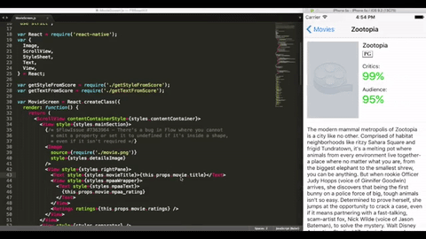

- title : Writing ReactNative applications with Fable
- description : Introduction to Fable and ReactNative
- author : Eugene Tolmachev
- theme : night
- transition : default

***

### Writing ReactNative applications with Fable 
Bringing together the F# and Native via JS ecosystem

  
     meets   
  

[fable.io](http://fable.io)

---

### ABOUT 

Speaker: Eugene Tolmachev

- Building software for over 20 years   
- Author of several OSS projects, including fable-elmish and FsShelter
- A principal architect @ Prolucid

Prolucid

- provides expertise in custom software development for mission critical 
  embedded, vision and cloud enabled applications.
- a sponsoring member of F# Foundation 
- F#unctional Toronto meetup sponsor 
- OSS sponsor of fable-elmish, FsStorm, FsShelter and many more 

***

### FABLE AT GLANCE

- Compiles F# source code to JavaScript
- Powered by the [F# compiler](http://fsharp.github.io/FSharp.Compiler.Service/) and [Babel](http://babeljs.io)
- Compatible with [most of FSharp.Core and some .NET BCL](http://fable-compiler.github.io/docs/compatibility.html)
- Source maps for F# code debugging
- No runtime, framework agnostic (fable-core is just a library)
- Runs on Web, Node, Desktop (Electron) and Mobile (React Native, Fuse) apps
- Extensible through [plugins](http://fable-compiler.github.io/docs/plugins.html)
- Young but growing [ecosystem](https://www.github.com/fable-compiler) ([packages available in npm](https://www.npmjs.com/search?q=fable))

> [fable-core](https://www.npmjs.com/package/fable-core) is just 20KB gzipped

***

### FABLE COMPATIBILITY WITH F#

- Records, Unions and Tuples
- Structural Equality and Comparison
- Comprehensions (seq, array, list)
- Computation Expressions
- Pattern Matching and Active Patterns
- Object Expressions
- Units of Measure
- Type Providers (must be written for Fable)

Check the [documentation](http://fable-compiler.github.io/docs/compatibility.html) for more info

---

### HELLO WORLD!

    [lang=shell]
    mkdir temp
    cd temp
    npm init --yes
    npm install -g fable-compiler
    npm install --save fable-core
    echo "printfn \"Hello World!\"" > hello.fsx
    fable hello.fsx
    node hello.js

***

### [fableconfig.json](https://github.com/fsprojects/Fable/blob/master/docs/compiling.md#fableconfigjson)

    [lang=json]
    {
        "module": "commonjs",
        "outDir": "out",
        "sourceMaps": true,
        "projFile": "src/Fable.Samples.React.fsproj",
        "scripts": {
            "prebuild": "npm install",
            "postbuild": "node node_modules/webpack/bin/webpack"
        },
        "targets": {
            "debug": {
                "watch": true,
                "symbols": ["DEV_SERVER"],
                "scripts": { "postbuild": "" }
            },
            "production": {
                "scripts": {
                    "postbuild": "node node_modules/webpack/bin/webpack -p"
                }
            }
        }
    }

***

### TESTING

NUnit or Visual Studio tests can be compiled to JS too

    #r "../../../packages/NUnit/lib/nunit.framework.dll"
    #load "util/util.fs"

    open NUnit.Framework

    [<Test>]
    let ``Util.reverse works``() =
        let res = Util.reverse "araN"
        Assert.AreEqual("Nara", res)

---

Compile the tests using NUnit plugin and run them with Mocha

    [lang=text]
    fable samples/node/console/tests.fsx -m commonjs
        --outDir out --plugins build/plugins/Fable.Plugins.NUnit.dll

    node build/tests/node_modules/mocha/bin/mocha
        samples/node/console/out/tests.js

***

### INTERACTING WITH JS

Fable takes advantage of JS ecosytem's full potential.

Because Functional Programming is <strong>fantastic</strong>

and JS ecosystem is...

<strong>HUGE</strong>

***

### MADE WITH FABLE: [IONIDE](http://ionide.io/)

F# Extension for VS Code and Atom

---

Fable itself has been developed with VS Code + Ionide!

---

### FABLE IN NUMBERS

- Currently in beta: [v0.6.x](https://www.npmjs.com/package/fable-compiler) (soon v1.0.0)
- 6 months since release
- >800 [unit tests](https://github.com/fsprojects/Fable/tree/master/src/tests)
- >800 commits, >500 stars, 37 contributors
- 25 packages in [npm](https://www.npmjs.com/~alfonsogarciacaro): compiler, core lib, bindings, TypeScript parser
- 5000 downloads last month

***

### REACT-NATIVE

With React Native, you don't build a “mobile web app”, an “HTML5 app”, or a “hybrid app”.
You build a real mobile app that's indistinguishable from an app built using Objective-C or Java. 
> React Native uses the same fundamental UI building blocks as regular iOS and Android apps.

---

### REACT-NATIVE DEMO

See effect of your code changes right away!

***

### ELM(ISH)

A library for writing F# applications following "model-view-update" pattern, as made famous by Elm.

>This pattern provides a way of creating self contained components that can be 
reused, combined, and composed in endless variety.

***

### Let's start coding!

[Workshop code](https://github.com/et1975/fable-reactnative-workshop/)

Don't forget to star the projects on GitHub:

[Fable](https://github.com/fable-compiler/Fable) | [Elmish](https://github.com/fable-compiler/fable-elmish)

and join the [F# Software Foundation](http://foundation.fsharp.org/join)!

  
Follow on Twitter:

  
<a href="https://twitter.com/FSharporg">@fsharporg</a>

  
<a href="https://twitter.com/FableCompiler">@FableCompiler</a>
 
  
<a href="https://twitter.com/prolucid">@prolucid</a>

